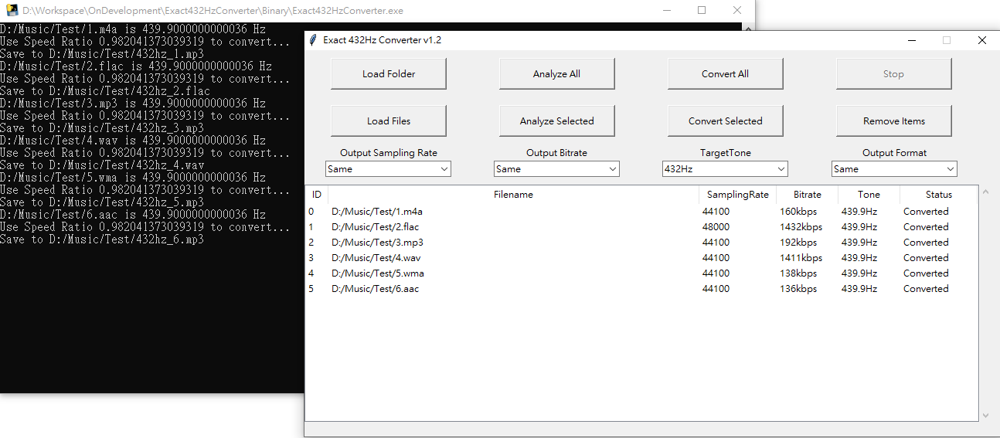

# Exact 432Hz Converter
## Python Version
### Introduction
- This program using FFT to extract the frequency band of audio files then calculate exact tone of audio files.

- Convert function provide exact 432Hz converter that convert all audio files into 432Hz (most is 440Hz to 432Hz)

### Environment
- conda create --name 432Hz python=3.7

- pip install numpy

- pip install pydub

- conda install ffmpeg

### Execution
- python Exact432HzConverter.py

### File Format
- Supported Input: .m4a, .flac, .mp3, .wav, .wma, .aac 

- Supported Output: .flac, .mp3, .wav

- It will convert to .mp3 if Input is .m4a, .wma, .aac and OutputFormat set to Same

